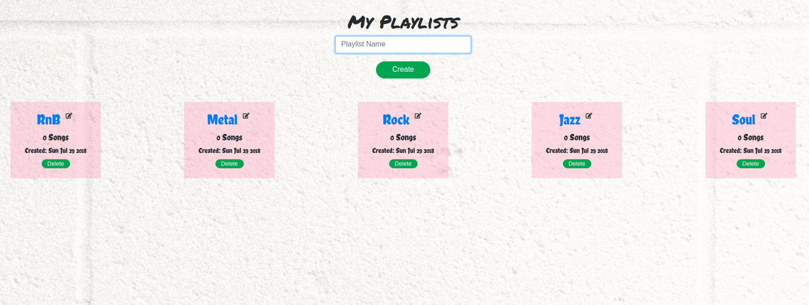
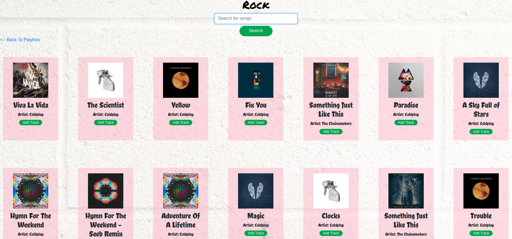

# LISTIO

## SUMMARY

Listio is a web application that allows the user to create, edit and populate their own playlists fetching songs data from the Spotify API.

## LIVE DEMO

[Listio Demo](https://nameless-springs-69015.herokuapp.com/)

## WALKTHROUGH VIDEO

[Listio Walkthrough Video](https://www.youtube.com/watch?v=Ah9QUKT9Clk)

## TECHNOLOGIES USED

- HTML
- CSS
- JavaScript
- JQuery
- Font Awesome
- Google Fonts
- Spotify API
- NodeJS
- ExpressJS
- MongoDB
- Mongoose
- JWT Authentication
- Mocha
- Chai
- TravisCI
- Heroku
- JSDoc

## API Documentation

[Documentation](https://krloslao.github.io/Listio/global.html)

## Screenshot

